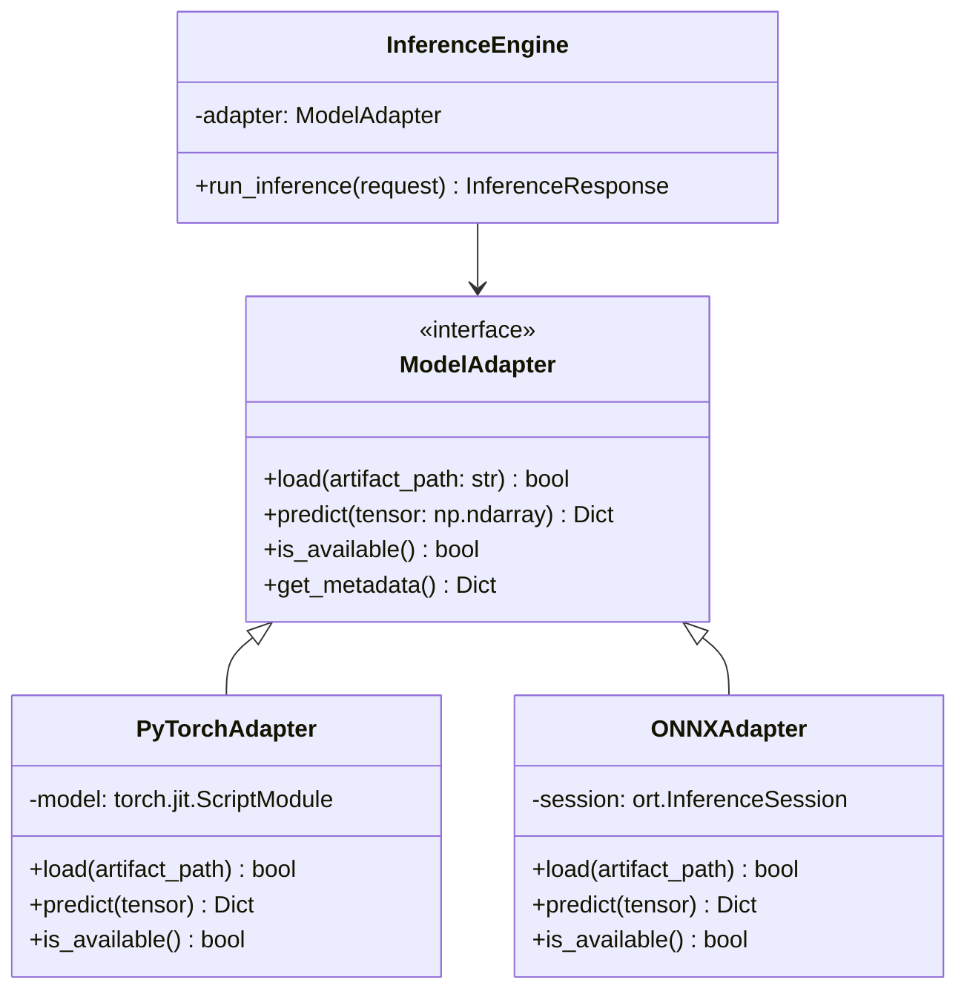

# VetVision AI Inference & Research Pipeline

## 1. Overview & Ethical Principles

VetVision AI integrates machine learning for bovine dermatological screening, with an initial research focus on **Lumpy Skin Disease (LSD)**. The service is strictly partitioned as an internal-only inference microservice (`services/ai`) accessible solely by the application backend.

### Critical Safety Principles
1. **Screening vs. Diagnosis:** Predictions are presented exclusively as **AI-assisted clinical screening indications**, never as definitive veterinary medical diagnoses.
2. **Honesty & Integrity:** If model weights are not configured or missing from the filesystem, the service strictly reports `MODEL_UNAVAILABLE`. Under no circumstances are predictions or probabilities mathematically hallucinated or fabricated.
3. **Abstention & Confidence Thresholds:** If the model's top class probability falls below the clinical confidence threshold (default: $0.65$ or $65\%$), the system flags the result as `LOW_CONFIDENCE` with an explicit recommendation for licensed veterinary review.

---

## 2. Target Classes & Severity Hierarchy

For the Bovine Cutaneous screening task, images are classified into three mutually exclusive categories:

| Class | Clinical Description | Recommended Clinical Action |
|---|---|---|
| `NORMAL` | Intact epidermis, no circumscribed nodular eruptions detected. | Continue standard herd biosecurity & routine vaccination schedule. |
| `MILD` | Early or localized circumscribed nodules (1-5cm), minimal cutaneous necrosis. | Isolate animal to paddock quarantine, initiate veterinary consultation, monitor rectal temperature. |
| `SEVERE` | Generalized eruptive nodules across neck, flanks, and perineum; sit-fast necrotic sloughing; secondary edema. | Immediate veterinary intervention, systemic anti-inflammatory therapy, report to local livestock health authority. |

---

## 3. Preprocessing Pipeline

The image preprocessing pipeline standardizes arbitrary camera captures into normalized tensor formats:

```mermaid
flowchart LR
    RawImage[Raw Image JPEG/PNG/WEBP] --> Stripping[RGB Channel Conversion\n(Strip Alpha)]
    Stripping --> Resize[Bilinear Resample\n(224 x 224 px)]
    Resize --> Scaling[Scale Pixel Intensity\n[0.0, 1.0]]
    Scaling --> Norm[ImageNet Normalization\nmean=[0.485, 0.456, 0.406]\nstd=[0.229, 0.224, 0.225]]
    Norm --> Tensor[NCHW Tensor\n(1, 3, 224, 224)]
```

---

## 4. Model Adapter Architecture

The inference engine decouples the execution backend using the `ModelAdapter` abstraction:



---

## 5. Benchmarking & Latency Profiling

The benchmarking suite (`services/ai/benchmarks/latency_benchmark.py`) profiles execution metrics across:
- **Warmup runs:** 10 iterations to eliminate JIT compilation or cache misses.
- **Latency Distribution:** Min, Mean, Median (p50), 95th percentile (p95), 99th percentile (p99), and standard deviation.
- **Throughput:** Frames per second (FPS).
- **Model Footprint:** Physical byte size of weights artifact on disk.

To execute benchmarks against an active model:
```bash
python -m benchmarks.latency_benchmark
```
