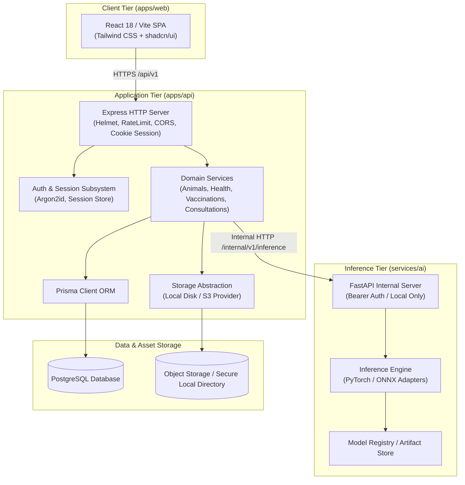
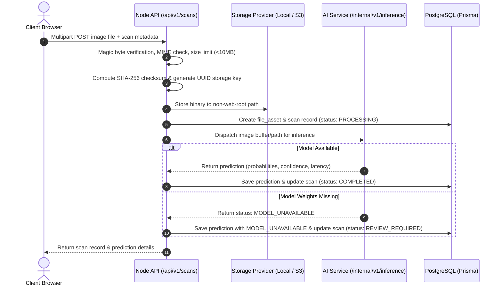
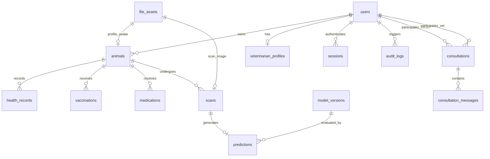

# VetVision AI Architecture Specification

## 1. System Context & Overview

VetVision AI is an enterprise-grade veterinary platform uniting companion pet and cattle health management with machine-learning-assisted skin lesion screening (focusing on Lumpy Skin Disease - LSD).

The architecture is explicitly segregated into three decoupled execution domains:
1. **Client Tier (`apps/web`):** Single-page web application built with React, TypeScript, Vite, Tailwind CSS, and shadcn/ui.
2. **Application Tier (`apps/api`):** Node.js Express service handling authenticated sessions, relational persistence via Prisma ORM, file metadata, and business domain logic.
3. **Inference Tier (`services/ai`):** Private Python FastAPI service handling image normalization, tensor transformations, PyTorch/ONNX inference execution, latency profiling, and evaluation pipelines.

---

## 2. Service Boundaries & Isolation

### 2.1 Web Application (`apps/web`)
- Pure client-side bundle communicating with Node API via `/api/v1/*`.
- Authentication state maintained strictly via `HttpOnly`, `SameSite=Lax`, `Secure` session cookies. Tokens are **never** stored in `localStorage` or `sessionStorage` to mitigate XSS extraction.
- Fully typed data contracts utilizing shared DTOs from `packages/shared-types`.

### 2.2 Node.js API Gateway & Backend (`apps/api`)
- Single point of public API ingress.
- Strict request validation using Zod schemas (`packages/validation`).
- Centralized error handling providing uniform error response envelopes (`{ success: false, error: { code, message, details? } }`).
- Structured audit logging capturing security-sensitive actions without leaking passwords or binary payloads.
- Role-based access control protecting resources at the database query level.

### 2.3 Python AI Service (`services/ai`)
- Completely isolated from public access. Listens on an internal port or private Docker network.
- Requires internal service secret (`X-Internal-Token`) supplied exclusively by the Node API.
- Implements `ModelAdapter` interface with concrete implementations:
  - `PyTorchAdapter` for `.pt` / `.pth` TorchScript weights.
  - `ONNXAdapter` for optimized `.onnx` runtimes.
- Returns explicit status:
  - `AVAILABLE`: Successful prediction with probability distribution and latency metrics.
  - `LOW_CONFIDENCE`: Screening probability beneath clinical confidence threshold.
  - `MODEL_UNAVAILABLE`: Valid weights not mounted; non-AI application features proceed uninterrupted.
  - `FAILED`: Preprocessing or tensor calculation error.

---

## 3. Storage Abstraction Architecture

File uploads (animal pictures, lesion scans, consultation attachments) are security critical. The storage subsystem enforces strict isolation:

### Safety Rules:
- Original file names are never preserved on the filesystem (prevents path traversal and execution).
- Storage keys are randomized UUIDs with verified extensions.
- Downloads are routed through authenticated endpoints (`/api/v1/files/:id`) or short-lived signed URLs.

---

## 4. Database Relational Topology

The relational model handles users, veterinary credentials, animals, clinical records, media assets, AI predictions, and consultation histories:

---

## 5. Security Posture

1. **Authentication:** Argon2id (memoryCost: 65536, timeCost: 3, parallelism: 4). Session cookies are hashed server-side (SHA-256).
2. **Access Control:** All data access is scoped to the authenticated user's ID or verified veterinarian consultation assignment.
3. **Attack Mitigations:**
   - Helmet HTTP headers (CSP, HSTS, X-Content-Type-Options, Frameguard).
   - IP and user-based Rate Limiting (express-rate-limit).
   - CORS restricted to configured web client origins.
   - Comprehensive input validation using Zod before any business logic executes.
