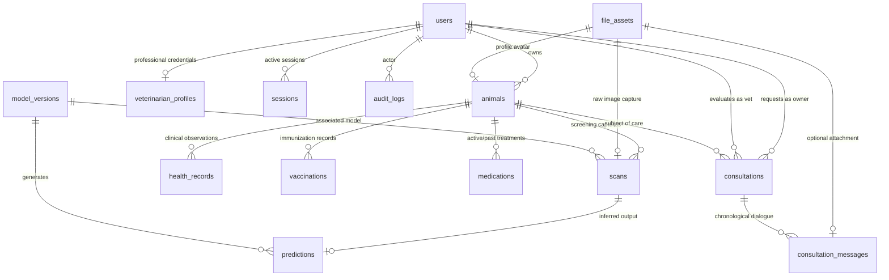

# VetVision AI Database Design & Data Dictionary

## 1. Overview

VetVision AI utilizes PostgreSQL as its primary relational datastore managed through Prisma ORM. The relational model is normalized to Third Normal Form (3NF) to guarantee referential integrity across medical histories, diagnostic imaging records, veterinarian credentials, and audit logs.

---

## 2. Core Entities & Schema Architecture

### 2.1 Entity Relationship Diagram

---

## 3. Data Dictionary

### `users`
Represents platform accounts across three mutually exclusive roles: `OWNER`, `VETERINARIAN`, and `ADMIN`.
| Column | Type | Constraints | Description |
|---|---|---|---|
| `id` | UUID | PK, default `uuid()` | Public unique identifier |
| `email` | String | Unique, Indexed | Normalized lowercase email |
| `password_hash` | String | Not Null | Argon2id password hash |
| `role` | Enum | Default `OWNER` | User permissions role (`OWNER`, `VETERINARIAN`, `ADMIN`) |
| `first_name` | String | Not Null | Given name |
| `last_name` | String | Not Null | Family name |
| `phone` | String | Nullable | Contact phone number |
| `email_verified_at` | Timestamp | Nullable | Email confirmation timestamp |
| `created_at` | Timestamp | Default `now()` | Account creation timestamp |
| `updated_at` | Timestamp | Auto-updated | Record modification timestamp |

### `veterinarian_profiles`
Holds professional licensing and verification records for users with the `VETERINARIAN` role.
| Column | Type | Constraints | Description |
|---|---|---|---|
| `id` | UUID | PK | Profile identifier |
| `user_id` | UUID | Unique, FK -> `users(id)` | Associated user account |
| `license_number` | String | Not Null | State or national veterinary board license |
| `specialization` | String | Not Null | Medical specialization (e.g. Bovine Dermatology) |
| `experience_years` | Integer | Default 0 | Years of clinical practice |
| `clinic_name` | String | Nullable | Associated practice or hospital |
| `bio` | Text | Nullable | Professional biography |
| `verification_status`| Enum | Default `PENDING` | `PENDING`, `VERIFIED`, `REJECTED` |

### `animals`
Cattle, livestock, and companion animals managed by owners.
| Column | Type | Constraints | Description |
|---|---|---|---|
| `id` | UUID | PK | Animal identifier |
| `owner_id` | UUID | FK -> `users(id)`, Indexed | Owner user reference |
| `name` | String | Not Null | Animal tag or call name |
| `species` | Enum | Default `CATTLE` | `CATTLE`, `DOG`, `CAT`, `HORSE`, `SHEEP`, `GOAT`, `OTHER` |
| `breed` | String | Nullable | Breed specification |
| `sex` | Enum | Default `UNKNOWN` | `MALE`, `FEMALE`, `MALE_NEUTERED`, `FEMALE_SPAYED`, `UNKNOWN` |
| `date_of_birth` | Date | Nullable | Estimated or exact birth date |
| `weight` | Float | Nullable | Weight in kilograms |
| `color` | String | Nullable | Physical coloration |
| `identification_number` | String | Nullable | RFID tag, ear tag, or microchip ID |
| `profile_image_id` | UUID | Nullable, FK -> `file_assets(id)` | Avatar reference |

### `scans` & `predictions`
Scans represent uploaded diagnostic imaging events. Predictions store the ML evaluation metrics and probabilities.
- **Scans status**: `UPLOADED`, `PROCESSING`, `COMPLETED`, `FAILED`, `REVIEW_REQUIRED`.
- **Predictions status**: `AVAILABLE`, `LOW_CONFIDENCE`, `MODEL_UNAVAILABLE`, `FAILED`.
- **Predicted classes**: `NORMAL`, `MILD`, `SEVERE`.
- Probability distribution columns: `normal_probability`, `mild_probability`, `severe_probability` (Float 0.0 - 1.0).

---

## 4. Indexing & Integrity Strategies

1. **Foreign Key Cascades:** Deleting a user cascades to their sessions, animals, and files; deleting an animal cascades to health records, scans, and vaccinations.
2. **Index Optimization:**
   - Composite lookup indexes on `(animalId, recordedAt)` for efficient chronological timeline queries.
   - Index on `scans(status)` and `scans(captureTimestamp)` for rapid queuing and owner dashboard history.
   - Hash index on `sessions(session_token_hash)` for O(1) session validation on every authenticated HTTP request.
