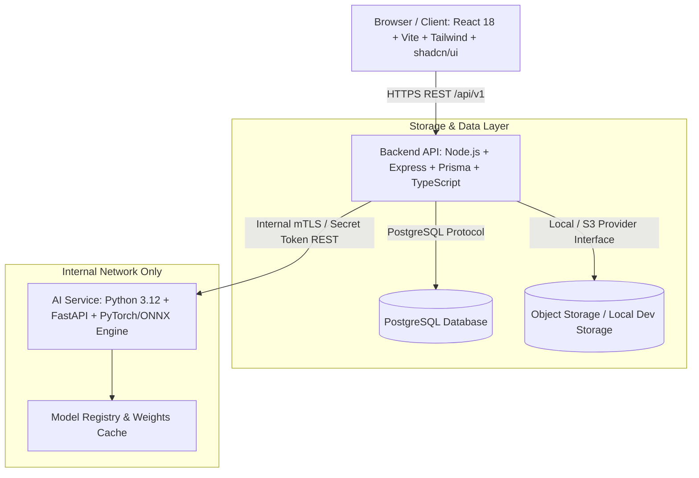
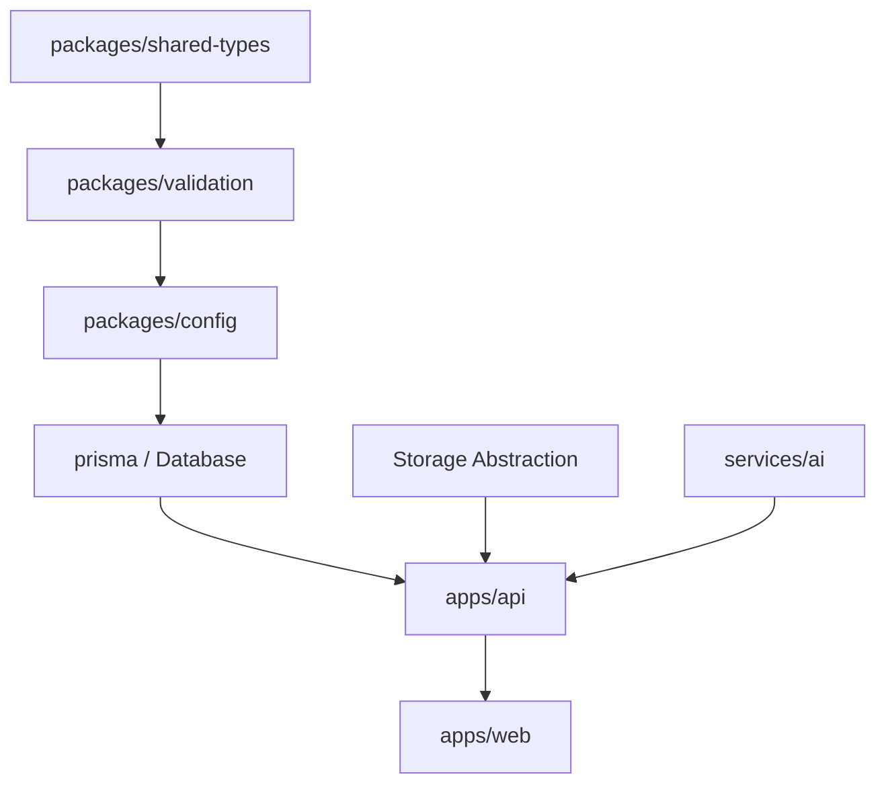

# VetVision AI: Comprehensive Implementation Plan

## 1. Executive Summary & Vision

VetVision AI is an AI-assisted veterinary health platform engineered to bridge the gap between pet and livestock health monitoring, diagnostic imaging, and licensed veterinary care. The initial clinical research focus is on **Lumpy Skin Disease (LSD)** screening in cattle, with extensible support for companion pets and broader veterinary workflows.

Crucially, VetVision AI is built as a **production-ready, real-world system**, strictly avoiding mock APIs, fake timeouts, or fabricated AI predictions. When real AI model weights are not configured in the environment, the inference engine explicitly reports `MODEL_UNAVAILABLE` rather than hallucinating predictions, while the full health record and consultation platform remains 100% operational.

---

## 2. Target Architecture Overview

The system operates across three decoupled service layers:



### Architectural Principles
1. **Separation of Concerns:** The Node API orchestrates business logic, access control, database transactions, and client communications. The Python FastAPI service operates strictly on AI preprocessing, model inference, performance benchmarking, and evaluation metrics.
2. **Security & Zero-Trust Client:** Clients never supply their own roles or access unassigned records. Password hashing uses Argon2id. Sessions are server-managed with HttpOnly, Secure, SameSite cookies.
3. **Storage Abstraction:** Media uploads undergo strict MIME verification, size checks, magic-byte inspection, and randomized storage keys. Files are stored outside web roots and served via authenticated signed URLs.
4. **Resilient AI Pipeline:** Real model adapter interface with `PyTorchAdapter` and `ONNXAdapter`. Clear distinction between AI-assisted screening and veterinary medical diagnosis. If weights are absent, status is `MODEL_UNAVAILABLE`.
5. **Full Veterinary Review Cycle:** Owners request consultations and share scan/health histories; licensed veterinarians review records, exchange consultation messages, and author clinical notes.

---

## 3. Milestones & Phases

```mermaid
gantt
    title VetVision AI Development Roadmap
    dateFormat  YYYY-MM-DD
    section Setup & Core
    Phase 0: Audit & Implementation Plan     :done, p0, 2026-10-01, 1d
    Phase 1: Foundation & Monorepo Setup    :active, p1, after p0, 1d
    Phase 2: Database & Prisma Schema        :p2, after p1, 1d
    section Backend & AI
    Phase 3: Auth & Authorization Engine     :p3, after p2, 1d
    Phase 4: Animal & Health Management      :p4, after p3, 1d
    Phase 5: Secure Storage & Scan Pipeline  :p5, after p4, 1d
    Phase 6: AI Service & Model Adapters     :p6, after p5, 1d
    Phase 7: Longitudinal Health Tracking    :p7, after p6, 1d
    Phase 8: Veterinary Consultation Flow   :p8, after p7, 1d
    section Frontend & Hardening
    Phase 9: Frontend Web Application        :p9, after p8, 2d
    Phase 10: Automated Test Suite           :p10, after p9, 1d
    Phase 11: Security Hardening & Auditing  :p11, after p10, 1d
    Phase 12: Deployment & Final Verification:p12, after p11, 1d
```

### Detailed Phase Breakdown

- **Phase 0: Audit & Architecture Reconcile**
  - Verify Git configuration, hooks, Node.js, Python, and local prerequisites.
  - Formulate implementation plan and architecture blueprint.
- **Phase 1: Foundation & Monorepo**
  - Configure root `package.json` workspaces (`apps/*`, `packages/*`).
  - Establish `packages/shared-types` (domain types, DTOs, Enums).
  - Establish `packages/validation` (shared Zod schemas).
  - Establish `packages/config` (environment validation).
  - Configure TypeScript strict configs, ESLint, and scripts.
- **Phase 2: Database & Prisma**
  - Configure Prisma schema with all 14 required models, relations, indexes, and enums.
  - Implement idempotent development seed script (`prisma/seed.ts`) covering Owner, Vet, Admin, Animals, Health Records, Vaccinations, Medications, and Consultations.
- **Phase 3: Authentication & Authorization**
  - Implement Argon2id hashing, secure session storage, and cookie management.
  - Implement role-based middleware (`OWNER`, `VETERINARIAN`, `ADMIN`).
  - Implement authentication routes (`/api/v1/auth/*`), password management, and audit logging.
- **Phase 4: Animal & Health Record Management**
  - Implement CRUD APIs for animals, health records, vaccinations, and medications.
  - Enforce ownership validation and role restrictions.
- **Phase 5: File Storage & Scan Ingestion Pipeline**
  - Build storage provider abstraction (`LocalStorageAdapter`, `S3StorageAdapter`).
  - Implement file asset upload handling with magic-byte validation, size limits, and checksums.
  - Implement `/api/v1/scans` orchestration.
- **Phase 6: AI Service & Inference Contract**
  - Build Python FastAPI service in `services/ai`.
  - Implement `ModelAdapter` abstract base class with `PyTorchAdapter` and `ONNXAdapter`.
  - Implement `InferenceEngine` handling preprocessing, latency benchmarking, and confidence scoring.
  - Implement fallback handling returning `MODEL_UNAVAILABLE` when weights are unconfigured.
  - Connect Node backend to internal AI service endpoint.
- **Phase 7: Longitudinal Tracking & Health Analytics**
  - Implement unified chronological health timeline API for animals.
  - Aggregate scans, AI results, veterinarian notes, vaccinations, and medications over time.
- **Phase 8: Veterinary Consultation Workflow**
  - Implement consultation lifecycle: `REQUESTED` -> `ACCEPTED` -> `SCHEDULED` -> `IN_PROGRESS` -> `COMPLETED`.
  - Implement persistent consultation messaging and clinical notes authored by veterinarians.
- **Phase 9: Frontend Web Application**
  - Build modern, accessible React + Vite + Tailwind + shadcn/ui application.
  - Implement public pages (Landing, About, How It Works, Auth).
  - Implement Owner portal (Dashboard, Animals, Health, Scan Upload, Scan Results, Consultations).
  - Implement Veterinarian portal (Dashboard, Consultations review, Clinical Notes, Animal History).
  - Implement Admin portal (Users, Vet Verification, Model Registry, Audit Logs).
- **Phase 10: Automated Testing**
  - Backend integration tests (Supertest / Vitest).
  - AI service tests (Pytest).
  - Frontend component tests (Vitest + Testing Library).
  - End-to-end integration flows.
- **Phase 11: Security Hardening**
  - Helmet headers, strict CORS, rate limiting, audit trail verification, input sanitization.
- **Phase 12: Deployment & Documentation**
  - Docker Compose multi-container setup (DB, API, AI, Web).
  - Comprehensive documentation (`api.md`, `database.md`, `ai-pipeline.md`, `security.md`, `deployment.md`).
  - Verification checklist and final acceptance confirmation.

---

## 4. Dependency Graph



---

## 5. Assumptions & Provider Abstractions

To adhere to the core requirement of not fabricating third-party dependencies or proprietary resources:

1. **Storage Provider:**
   - Development default: `LocalStorageAdapter` saving to a secure directory outside the web root (`./data/storage`) with signed token delivery.
   - Production interface: `S3StorageAdapter` compliant with AWS S3 / Cloudflare R2 / MinIO.
2. **AI Model Weights:**
   - If no validated PyTorch `.pt`/`.pth` or ONNX `.onnx` weight file is supplied in `MODEL_ARTIFACT_PATH`, the AI service registers `MODEL_UNAVAILABLE`.
   - The UI displays explicit informational banners: *"AI model weights not configured. Clinical screening offline. Non-AI clinical workflows remain operational."*
3. **Email Provider:**
   - Configurable email interface (`ConsoleEmailAdapter` for local dev/testing; SMTP / SendGrid / Postmark for production).
4. **Consultation Messaging:**
   - Real-time polling / WebSocket-ready persistent PostgreSQL messages. Fake WebRTC/video is strictly avoided.

---

## 6. Verification Strategy

Every milestone will be validated against:
1. **Type Checking:** `tsc --noEmit` across all workspaces.
2. **Linting & Code Style:** ESLint & Prettier passing without warnings.
3. **Unit & Integration Tests:** Automated tests confirming business rules, auth barriers, and edge cases.
4. **Runtime Verification:** Starting servers and executing actual HTTP calls.
5. **Git Integrity:** Only committing verified, clean states, triggering the post-commit push safely.
